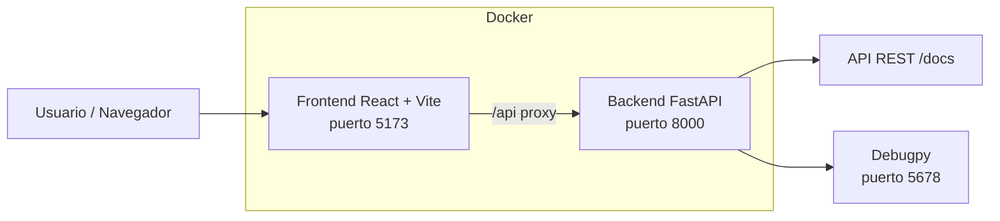

# Diagrama de arquitectura

## Descripción

- El usuario accede al frontend en `http://localhost:5173`
- El frontend reenvía llamadas a `/api` al backend usando el proxy configurado en [frontend/vite.config.ts](../frontend/vite.config.ts)
- El backend expone la API REST en `http://localhost:8000`
- La documentación interactiva de la API está en `http://localhost:8000/docs`
- El puerto `5678` está reservado para depuración del backend (debugpy)

## Fuentes

- [docker-compose.yml](../docker-compose.yml)
- [frontend/vite.config.ts](../frontend/vite.config.ts)
- [backend/Dockerfile](../backend/Dockerfile)
- [backend/app/main.py](../backend/app/main.py)
- [README.md](../README.md)
